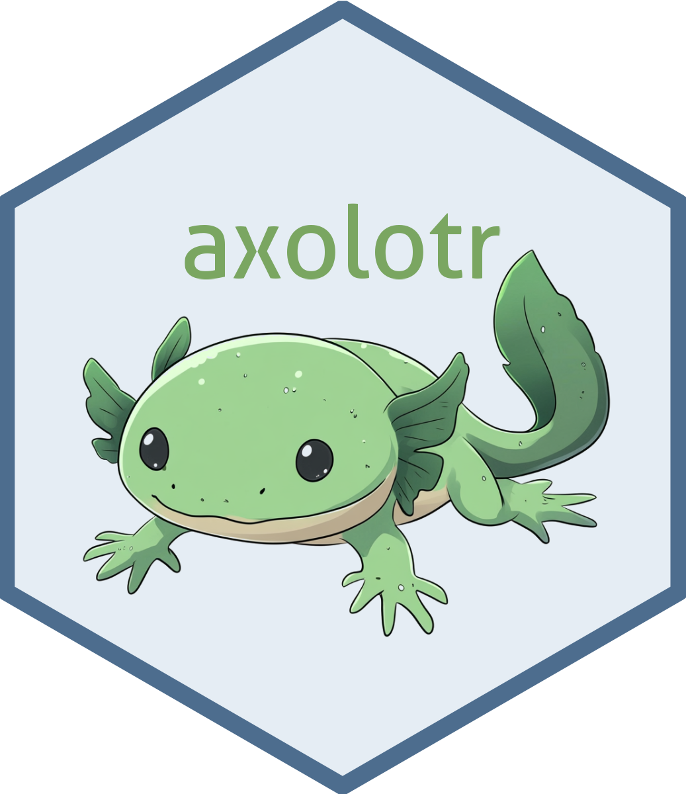

<!-- README.md is generated from README.Rmd. Please edit that file -->
```{r, include = FALSE}
knitr::opts_chunk$set(
  collapse = TRUE,
  comment = "#>",
  fig.path = "man/figures/README-",
  out.width = "100%"
)
```

# axolotr 

<!-- badges: start -->
[](https://github.com/heurekalabsco/axolotr/actions)
[](https://CRAN.R-project.org/package=axolotr)
<!-- badges: end -->

The goal of axolotr is to provide a unified interface for interacting with various Language Model APIs, including OpenAI's GPT, Google's Gemini, Anthropic's Claude, and Groq's API. This package allows users to easily switch between different LLMs and leverage their capabilities for a wide range of natural language processing tasks.

## Installation

You can install the development version of axolotr from [GitHub](https://github.com/) with:

```r
# install.packages("devtools")
devtools::install_github("heurekalabsco/axolotr")
```

## Setup

Before using axolotr, you need to set up your API keys. You can do this by adding them to your `.Renviron` file:

```r
library(axolotr)

create_credentials(
  OPENAI_API_KEY = "your_openai_key",
  GOOGLE_GEMINI_API_KEY = "your_google_key",
  ANTHROPIC_API_KEY = "your_anthropic_key",
  GROQ_API_KEY = "your_groq_key"
)
```

Remember to restart your R session after setting up the credentials.

## Quick Start

The `ask()` function provides a simple, unified interface for all supported LLMs with common parameters:

```r
library(axolotr)

# Simple query with default model (Claude)
response <- ask("What is the capital of France?")

# Using a specific provider
response <- ask("Explain quantum computing", model = "openai")

# With system message
response <- ask(
  prompt = "Generate a short poem about AI",
  system = "You are a renowned poet with technical knowledge",
  model = "gemini"
)

# Using a specific model version
response <- ask(
  prompt = "Compare deep learning and traditional machine learning",
  model = "gpt-4o"
)
```

## Model Selection

`axolotr` supports multiple ways to specify which model to use:

```r
# Generic provider names (uses recommended default model)
ask("Your prompt", model = "anthropic")  # Uses Claude 3.7 Sonnet
ask("Your prompt", model = "openai")     # Uses GPT-4o
ask("Your prompt", model = "google")     # Uses Gemini 1.5 Pro
ask("Your prompt", model = "groq")       # Uses Mixtral 8x7B

# Generic model families
ask("Your prompt", model = "claude")     # Uses Claude 3.7 Sonnet
ask("Your prompt", model = "sonnet")     # Uses Claude 3.7 Sonnet
ask("Your prompt", model = "opus")       # Uses Claude 3 Opus
ask("Your prompt", model = "haiku")      # Uses Claude 3.5 Haiku
ask("Your prompt", model = "gpt")        # Uses GPT-4o
ask("Your prompt", model = "gpt-4")      # Uses GPT-4o
ask("Your prompt", model = "gpt-3")      # Uses GPT-3.5 Turbo
ask("Your prompt", model = "gemini")     # Uses Gemini 1.5 Pro
ask("Your prompt", model = "mixtral")    # Uses Mixtral 8x7B
ask("Your prompt", model = "llama")      # Uses Llama3 70B

# Specific model versions
ask("Your prompt", model = "claude-3-7-sonnet-latest")
ask("Your prompt", model = "gpt-4o")
ask("Your prompt", model = "llama3-70b-8192")
```

## Advanced Usage

For advanced features specific to each model, use the direct functions instead of the `ask()` wrapper:

### Claude-specific features (Anthropic)

```r
# Using Claude's "thinking" capability for complex reasoning
response <- ask_anthropic(
  prompt = "Solve this complex math problem step by step: 
            If f(x) = 3x² + 2x - 5 and g(x) = 2x - 1, find f(g(3))",
  model = "claude-3-7-sonnet-latest",
  thinking = 20000,  # Allocate 20K tokens for thinking
  max_tokens = 40000  # Total response limit including thinking
)

# Reading PDF files with Claude
response <- ask_anthropic(
  prompt = "Summarize the main points from this research paper",
  pdf_path = "research_paper.pdf",
  cache_pdf = TRUE  # Cache PDF content for 5 minutes across calls
)

# System messages with caching
response <- ask_anthropic(
  prompt = "Write a technical specification for a new mobile app",
  system = "You are an expert software architect with 20 years of experience...",
  cache_system = TRUE,  # Cache system prompt for 5 minutes across calls
  temperature = 0.2
)

# Pre-filling responses
response <- ask_anthropic(
  prompt = "Continue this list of best practices for R programming:",
  pre_fill = "1. Use consistent naming conventions\n2. Document your functions\n"
)
```

### OpenAI-specific features

```r
# Using a specific model with custom parameters
response <- ask_openai(
  prompt = "Write a story about an AI researcher",
  model = "gpt-4o",
  temperature = 0.9,
  max_tokens = 2048
)
```

### Google Gemini-specific features

```r
# Using Gemini with specific temperature
response <- ask_google(
  prompt = "Generate a creative marketing slogan for an eco-friendly product",
  model = "gemini-1.5-pro",
  temperature = 1.0  # Maximum creativity
)
```

### Groq-specific features

```r
# Using Groq for fast inference
response <- ask_groq(
  prompt = "Explain deep learning in simple terms",
  model = "llama3-70b-8192",
  temperature = 0.3,
  max_tokens = 8192
)
```

## Image Generation

Generate images using DALL-E models:

```r
# Generate an image with DALL-E 3
image_url <- imagine_openai(
  prompt = "A cute axolotl wearing a lab coat and glasses, digital art style",
  model = "dall-e-3",
  image_size = "1024x1024",
  image_style = "vivid"
)

# Use the URL in your application or open in browser
browseURL(image_url)
```

## Features

- Unified interface for multiple LLM APIs
- Flexible model selection (generic or specific model names)
- Easy setup of API credentials
- Support for Claude 3.7 Sonnet's thinking capability
- PDF document processing with Claude
- System prompt caching for improved performance
- Image generation with DALL-E

## Roadmap

- Function calling/tools API support
- Integration with local models via Ollama
- Multi-modal inputs (images, audio)
- Batch processing of prompts
- Rate limiting and retry mechanisms

## Contributing

Contributions to axolotr are welcome! Please feel free to submit a Pull Request.

## License

This project is licensed under the MIT License - see the [LICENSE.md](LICENSE.md) file for details.
